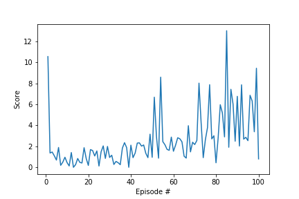

# Project report

## Introduction

The goal of this project is to train an agent to operate a double jointed robotic arm in a virtual world such that the arm maintains it's position in some target location. A reward of +0.1 is provided for each step that the agent's hand is in the goal location. A succesfully trained agent must get an average score of +30 over 100 consecutive episodes.


## Environment

The observation space consists of 33 variables corresponding to position, rotation, velocity, and angular velocities of the arm. Each action is a vector with four numbers, corresponding to torque applicable to two joints. Every entry in the action vector should be a number between -1 and 1.

```
INFO:unityagents:
'Academy' started successfully!
Unity Academy name: Academy
        Number of Brains: 1
        Number of External Brains : 1
        Lesson number : 0
        Reset Parameters :
        goal_speed -> 1.0
        goal_size -> 5.0
Unity brain name: ReacherBrain
        Number of Visual Observations (per agent): 0
        Vector Observation space type: continuous
        Vector Observation space size (per agent): 33
        Number of stacked Vector Observation: 1
        Vector Action space type: continuous
        Vector Action space size (per agent): 4
        Vector Action descriptions: , , , 
```


## Agent Training

### DDPG architecture

To train the agent initially I used the original DDPG code from the Udacity repository but found that no matter what kind of hyperparameters I tried, the agent was unable to learn.  It averaged less than 2 on all the attempts. However after applying the following customisations I was able to jump start the agents learning:
1. Batch normalisation after each layer for both the actor and the critic networks, 
2. Set the weights of local actor, target actor, local critic and target critic to the same values

The final network had the following layers for both actor and critic:
- Fully connected layer - input: 33 (state size) output: 256
+ Batchnormalisation 
- Fully connected layer - input: 256 output 256
+ Batchnormalisation
- Fully connected layer - input: 256 output: 4 (action size)

Parameters used:

- Maximum steps per episode: 10000
- replay buffer size       : int(1e5) 
- minibatch size           : 512
- discount factor          : 0.99            
- TAU                      : 1e-3
- actor learning rate      : 2e-4
- critic learning rate     : 2e-4 

### Training Results

```
-----Training for 1000 episodes using a 128x128 architecture-----

Episode 100	Average Score: 4.89
Episode 200	Average Score: 16.41
Episode 300	Average Score: 23.24
Episode 400	Average Score: 26.94
Episode 500	Average Score: 25.24
Episode 600	Average Score: 26.12
Episode 700	Average Score: 22.01
Episode 800	Average Score: 24.44
Episode 900	Average Score: 29.44
Episode 945	Average Score: 30.00
Environment solved in 945 episodes!	Average Score: 30.00
```


|  |
|:--:| 
| Plot of average scores across entire training period using a 33x128x128x4 architecture |


```
-----Training for 1000 episodes using a 256x256 architecture-----

Episode 100	Average Score: 7.55
Episode 200	Average Score: 27.68
Episode 223	Average Score: 30.01
Environment solved in 223 episodes!	Average Score: 30.01
```


|  |
|:--:| 
| Plot of average scores across entire training period using a 33x256x256x4 architecture |


### Trained agent

The following checkpoints were created for one such solution:
1. checkpoint_actor.pth
2. checkpoint_critic.pth

|  |
|:--:| 
| Plot of average scores across entire training period using a 33x128x128x4 architecture |


## Ideas for future work

1. Extensive hyperparameter optimization
2. As can be seen from the graph, the agent still isn't very stable and has some very low scoring episodes even towards the end of the training runs. There's still scope from improvement here. This would require a systematic study of the effect of batch normalisation and/or dropout on the agents. 
3. Sampling the buffer could also offer some levels of improvement